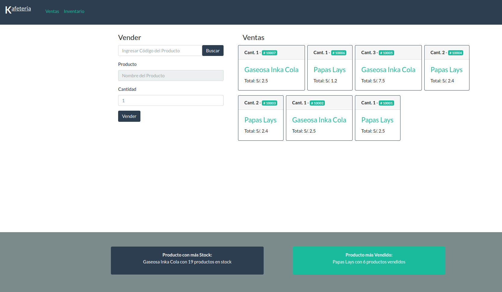
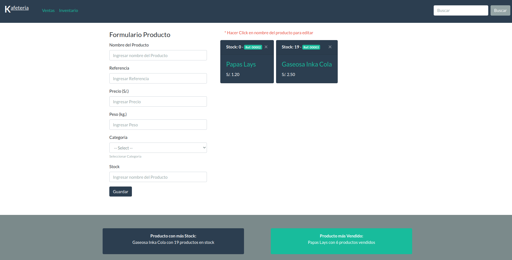

# Seventec - Konecta Prueba Técnica

Software para Gestionar Inventario y ventas de una Cafeteria.

## Stack

Herramientas y programas utilizados

- php
- mysql
- docker/docker-compose

## Instalación

`docker-compose up -d`

ejecutar script sql en contenedor dbx, ubicado en:

`/db/query_db/prueba_konecta_db.sql`

## Consultas a la base de datos

1. Producto que más stock tiene

    <pre>
        SELECT name, stock from products ORDER BY stock DESC LIMIT 1
    </pre>

2. Producto más vedido

    <pre>
    SELECT product_id , SUM(quantity) AS sells, p.name
    FROM orders o 
    INNER JOIN products p on p.id = o.product_id 
    GROUP BY product_id
    ORDER BY sells DESC
    LIMIT 1
    </pre>
## Images
 
<b>Vista Principal - Ventas</b>

 

<b>Vista Inventario- Productos</b>

